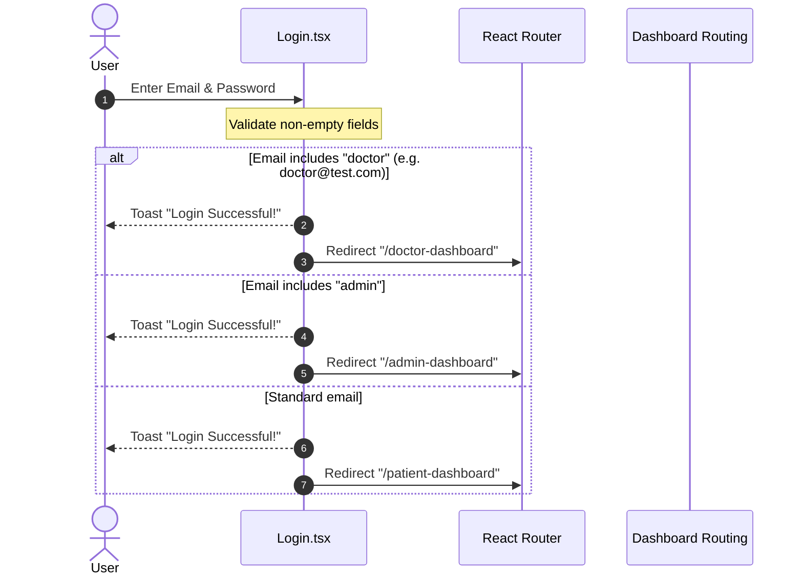
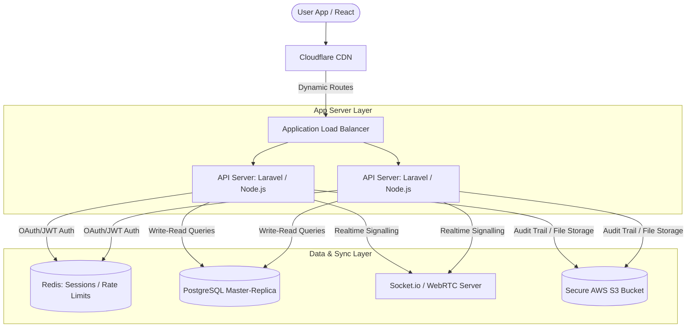

# Technical Literature Review: MedConnect (Healthcare Coordination Platform)

This document provides a comprehensive technical literature review of the **MedConnect** web application. It details the system's architecture, design tokens, codebase patterns, core user workflows, and a strategic backend roadmap for transitioning this high-fidelity prototype into a production-grade system.

---

## 1. Executive Summary & Purpose

**MedConnect** is a modern, high-tech healthcare coordination and diagnostic platform designed to address accessibility challenges in India's medical sector. The application serves as a centralized hub connecting patients, doctors, and hospitals. By integrating digital health records, dynamic appointment scheduling, and telemedicine capabilities, the platform aims to streamline the healthcare journey.

### Core Value Propositions:
1. **Unified Electronic Health Records (EHR):** Patients can securely centralize, organize, and access their entire medical history, prescriptions, and lab reports.
2. **Dynamic Doctor Discovery:** A multi-specialty registry allowing patients to search and filter verified medical professionals across India based on location, availability, fees, and telemedicine options.
3. **Optimized Patient Scheduling:** A role-based calendar booking engine providing direct portals for both patients and healthcare providers.
4. **Seamless Telemedicine:** Preparation for virtual clinical consults, enabling remote healthcare delivery.

---

## 2. Technology Stack & Architectural Overview

The application is structured as a client-side Single Page Application (SPA), emphasizing fast compile times, fluid transitions, and component reusability.

### 2.1 Technology Stack Details
* **Frontend Framework:** [React 18.3.1](file:///d:/RAHUL/My%20Projects/Lovable%20Projects/MedConnect/client/package.json#L51) (using TypeScript for strict typing).
* **Build Tooling:** [Vite 5.4.19](file:///d:/RAHUL/My%20Projects/Lovable%20Projects/MedConnect/client/package.json#L81) with `@vitejs/plugin-react-swc` for fast compiler performance via Rust-based tooling.
* **Navigation & Routing:** [React Router DOM 6.30.1](file:///d:/RAHUL/My%20Projects/Lovable%20Projects/MedConnect/client/package.json#L56) for declarative client-side route mapping.
* **Component Primitives:** [Radix UI](file:///d:/RAHUL/My%20Projects/Lovable%20Projects/MedConnect/client/package.json#L15-L41) (via shadcn/ui components) providing accessible, unstyled UI primitives.
* **Icons:** [Lucide React 0.462.0](file:///d:/RAHUL/My%20Projects/Lovable%20Projects/MedConnect/client/package.json#L49) for a clean, consistent vector iconography.
* **Form & Schema Management:** [React Hook Form](file:///d:/RAHUL/My%20Projects/Lovable%20Projects/MedConnect/client/package.json#L54) paired with [Zod](file:///d:/RAHUL/My%20Projects/Lovable%20Projects/MedConnect/client/package.json#L62) for frontend validations.

### 2.2 Client-Side Directory Structure
The workspace is organized around a modular structure:
```
client/
├── public/                 # Static public assets (images, icons)
├── src/
│   ├── assets/             # Core medical images & illustrations
│   ├── components/
│   │   ├── ui/             # Radix + Tailwind primitive components
│   │   ├── Navbar.tsx      # Responsive navigation header
│   │   └── Footer.tsx      # Standard global footer
│   ├── hooks/              # Custom React hooks (use-toast, use-mobile)
│   ├── lib/                # Shared utility functions (utils.ts)
│   ├── pages/              # Core page views (Home, Doctors, Dashboards)
│   ├── App.tsx             # Main routing configuration
│   ├── index.css           # Global Tailwind and HSL design tokens
│   └── main.tsx            # Application entry point
```

---

## 3. Design Tokens & Visual Aesthetics

MedConnect implements a highly curated design system built on custom HSL color tokens, typography, and micro-animations to create a premium, institutional medical appearance.

### 3.1 Design Token System (`index.css`)
The visual style is defined inside [index.css](file:///d:/RAHUL/My%20Projects/Lovable%20Projects/MedConnect/client/src/index.css) using CSS Custom Properties. The color palette centers around clinical, calming teal and energetic orange highlights:

| Property | HSL Value (Light) | HSL Value (Dark) | Description |
| :--- | :--- | :--- | :--- |
| `--background` | `0 0% 100%` | `210 20% 12%` | Default canvas background |
| `--primary` | `174 55% 55%` | `174 55% 55%` | Mint/Teal brand signature color |
| `--secondary` | `174 45% 96%` | `210 20% 18%` | Soft mint background panels |
| `--accent` | `25 95% 53%` | `25 95% 53%` | Contrast orange for key call-to-actions |
| `--muted` | `174 30% 94%` | `210 20% 18%` | Subtle borders and soft fills |
| `--radius` | `0.75rem` | `0.75rem` | Medium rounded corner sizing |

### 3.2 Animation Engine
Dynamic micro-interactions are configured within [tailwind.config.ts](file:///d:/RAHUL/My%20Projects/Lovable%20Projects/MedConnect/client/tailwind.config.ts#L66-L129), enhancing user feedback:
* **Float (`animate-float`):** A 3-second sinusoidal vertical translation used on the homepage hero elements to represent an active, fluid system state.
* **Fade In Up (`animate-fade-in-up`):** Used to introduce headings and cards with a smooth upward slide, reducing visual load during page transition.
* **Scale In (`animate-scale-in`):** Applied to dashboards and grid stats to create a responsive, tactical click feel.
* **Hover State Transformations:** Transition effects on navigation links (pill styling transitions) and cards (`hover:-translate-y-2 hover:shadow-xl`).

---

## 4. Deep-Dive: Core Subsystems & Technical Workflows

MedConnect integrates several key workflows representing standard hospital booking and patient registration mechanics.

### 4.1 Role-Based Simulated Authentication
Authentication pages validate forms using standard controlled inputs, dispatching users dynamically based on credential domains:



* **Registration Validation:** [Register.tsx](file:///d:/RAHUL/My%20Projects/Lovable%20Projects/MedConnect/client/src/pages/Register.tsx#L21-L37) performs password complexity validation (min-length: 6, matching confirmations) and sets a user-role dropdown selection (`patient` or `doctor`) before redirecting to the login flow.

### 4.2 The Doctor Discovery Registry
The doctor search portal [Doctors.tsx](file:///d:/RAHUL/My%20Projects/Lovable%20Projects/MedConnect/client/src/pages/Doctors.tsx) enables real-time client-side registry filtering:
* **Combined Filtering Logic:**
  ```typescript
  const filteredDoctors = doctors.filter((doctor) => {
    const matchesSearch =
      doctor.name.toLowerCase().includes(searchQuery.toLowerCase()) ||
      doctor.specialty.toLowerCase().includes(searchQuery.toLowerCase());
    const matchesSpecialty =
      selectedSpecialty === "all" ||
      doctor.specialty.toLowerCase() === selectedSpecialty.toLowerCase();
    return matchesSearch && matchesSpecialty;
  });
  ```
* **Registry Metadata Structure:** Tracks doctor attributes including rating scores, review counts, experience metrics, location tags, fees, consultation availability (today vs tomorrow), and video consult eligibility tags.

### 4.3 Patient Clinical Dashboard
[PatientDashboard.tsx](file:///d:/RAHUL/My%20Projects/Lovable%20Projects/MedConnect/client/src/pages/PatientDashboard.tsx) implements a patient portal containing:
* **Appointments Queue:** Lists scheduled appointments (Doctor, Specialty, Date, Time, Consultation Type).
* **Electronic Records Logs:** Lists historic diagnostic files (Blood tests, X-Rays, Prescriptions).
* **Clinical Vitals Summary:** Renders mock biometric indicators (Blood Pressure, Heart Rate, Last Checkup date).

### 4.4 Doctor Dashboard
[DoctorDashboard.tsx](file:///d:/RAHUL/My%20Projects/Lovable%20Projects/MedConnect/client/src/pages/DoctorDashboard.tsx) models a clinical practitioner portal:
* **Daily Queue Tracker:** Tracks the doctor's today queue including status (Confirmed, Pending) and consult method.
* **Patient Logs:** Historical table linking patients with their specific conditions (Follow-ups, Consultations).
* **Availability Toggle:** Control to change practitioner availability in real time.

---

## 5. Strategic Architectural Recommendations for Production Scaling

To transition MedConnect from a high-fidelity React frontend prototype into a production-ready, secure, and compliant healthcare application, the following backend architecture and state integrations are recommended:



### 5.1 Decoupled RESTful/GraphQL API backend
* **Technology:** Deploy a secure, high-performance API backend using **Laravel 12** or **NestJS**.
* **Authentication:** Migrate from domain-matching redirects to standard stateless token auth. Implement **OAuth2/OpenID Connect** or **JWT (JSON Web Tokens)** carried via HTTP-only secure cookies to prevent XSS.

### 5.2 Relational Database Schema (PostgreSQL)
To persist platform data, implement a relational schema with proper index fields:

```sql
-- PostgreSQL Production Schema Sketch

CREATE TABLE users (
    id UUID PRIMARY KEY DEFAULT gen_random_uuid(),
    name VARCHAR(255) NOT NULL,
    email VARCHAR(255) UNIQUE NOT NULL,
    password_hash VARCHAR(255) NOT NULL,
    phone VARCHAR(20) NOT NULL,
    role VARCHAR(20) CHECK (role IN ('patient', 'doctor', 'admin')),
    created_at TIMESTAMP WITH TIME ZONE DEFAULT CURRENT_TIMESTAMP
);

CREATE TABLE doctors (
    id UUID PRIMARY KEY DEFAULT gen_random_uuid(),
    user_id UUID REFERENCES users(id) ON DELETE CASCADE,
    specialty VARCHAR(100) NOT NULL,
    experience_years INT NOT NULL,
    location VARCHAR(255) NOT NULL,
    consultation_fee INT NOT NULL,
    video_consult_available BOOLEAN DEFAULT TRUE,
    rating NUMERIC(3, 2) DEFAULT 5.0,
    created_at TIMESTAMP WITH TIME ZONE DEFAULT CURRENT_TIMESTAMP
);

CREATE TABLE appointments (
    id UUID PRIMARY KEY DEFAULT gen_random_uuid(),
    patient_id UUID REFERENCES users(id) ON DELETE CASCADE,
    doctor_id UUID REFERENCES doctors(id) ON DELETE CASCADE,
    appointment_time TIMESTAMP WITH TIME ZONE NOT NULL,
    consultation_type VARCHAR(20) CHECK (consultation_type IN ('in-person', 'video')),
    status VARCHAR(20) DEFAULT 'pending' CHECK (status IN ('pending', 'confirmed', 'completed', 'cancelled')),
    created_at TIMESTAMP WITH TIME ZONE DEFAULT CURRENT_TIMESTAMP
);

CREATE TABLE medical_records (
    id UUID PRIMARY KEY DEFAULT gen_random_uuid(),
    patient_id UUID REFERENCES users(id) ON DELETE CASCADE,
    doctor_id UUID REFERENCES doctors(id) ON DELETE SET NULL,
    record_type VARCHAR(50) NOT NULL, -- 'blood-test', 'x-ray', 'prescription'
    file_path VARCHAR(512) NOT NULL, -- Encrypted S3 path
    uploaded_at TIMESTAMP WITH TIME ZONE DEFAULT CURRENT_TIMESTAMP
);

-- Indexing for search optimization
CREATE INDEX idx_doctors_specialty ON doctors(specialty);
CREATE INDEX idx_doctors_location ON doctors(location);
CREATE INDEX idx_appointments_time ON appointments(appointment_time);
```

### 5.3 Real-Time Telemedicine Infrastructure
* **WebRTC Integration:** Implement HD peer-to-peer video consultations utilizing WebRTC protocols. Integrate with a media server solution like **Jitsi Meet API** or **Twilio Video SDK** for multiparty calls and recording capabilities.
* **WebSocket Server:** Deploy a centralized WebSocket server (e.g. **Socket.io** or **Laravel Reverb**) to handle real-time doctor-patient chat, appointment reminders, and live availability updates.

### 5.4 HIPAA and DISHA Security Compliance
Under India's Digital Information Security in Healthcare Act (DISHA) and global HIPAA regulations, health data requires strict compliance:
1. **Data Encryption at Rest:** Encrypt sensitive medical records and user vitals using AES-256 at the database block level.
2. **Data Encryption in Transit:** Enforce TLS 1.3 across all APIs and WebSocket connections.
3. **Storage Security:** Store upload files in AWS S3 buckets configured with SSE (Server-Side Encryption) and access them using short-lived Presigned URLs.
4. **Immutable Audit Trails:** Implement an immutable logging table tracking every administrative, patient, and doctor view action on clinical files.

### 5.5 State Management Integration
* **Data Fetching:** Replace mock states in pages like [Doctors.tsx](file:///d:/RAHUL/My%20Projects/Lovable%20Projects/MedConnect/client/src/pages/Doctors.tsx) with **TanStack React Query** hooks.
* **Caching & Pagination:** Configure cache invalidation parameters on query keys (e.g. `['doctors', specialty, query]`). Implement paginated endpoints on the backend API to retrieve data in chunks, preventing memory exhaustion when the medical registry scales to thousands of practitioners.
